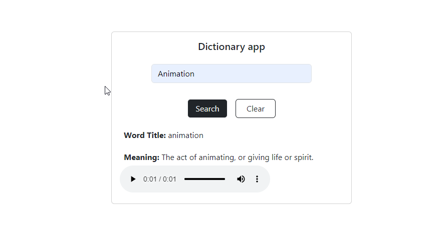

# Dictionary App

Welcome to the Dictionary App! This application allows users to look up the definitions of words, synonyms, and more.

## Features

- **Word Search**: Search for the meaning of any word.
- **Synonyms**: Find synonyms for the searched word.
- **Part of Speech**: Get information about the part of speech for the word.
- **Pronunciation**: Learn how to pronounce the word.

## Technologies Used

- **HTML**: For the structure of the application.
- **CSS**: For styling the application.
- **JavaScript**: For the functionality and interactivity of the application.
- **API**: Uses a dictionary API to fetch word definitions and related information.

## Getting Started

### Prerequisites

You will need a modern web browser to run this application.

### Installation

1. Clone the repository:
   ```bash
   git clone https://github.com/codewithfranciss/Dictionary-app.git


   
